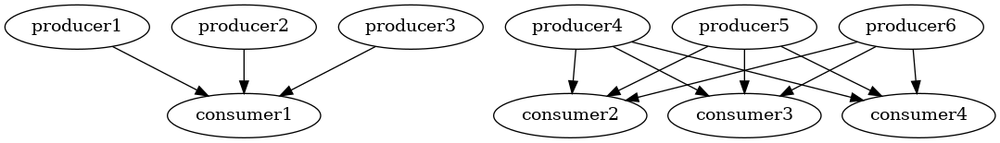
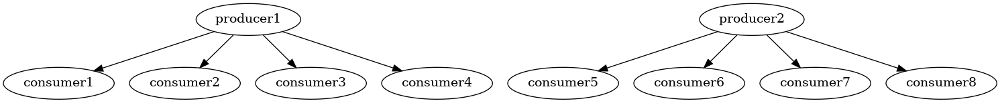
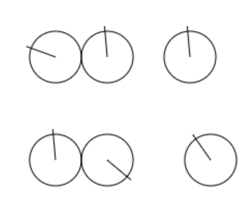
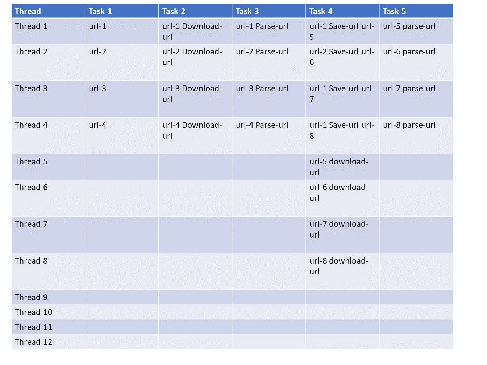

# dream-programming-language

This is the repository for my unnamed dream programming language and runtime.

* [Jump to "example programs"](https://github.com/samsquire/dream-programming-language#example-programs)

# context

I am a backend and devops engineer. I usually reach for Python to develop small programs to see how to implement something, then Java for multithreaded programs and C or Java for my own programming language implementation projects. I wrote the beginnings of an amd64 JIT compiler in C at https://github.com/samsquire/compiler. I tried to describe algebralang at https://github.com/samsquire/algebralang.

* [This HN comment of mine highlights some things I want](https://news.ycombinator.com/item?id=35998888).

# my dream

* But I want some language that helps me program and think but deliver ready-for-production quality and level solutions that are low maintenance and low cost.
* I want linear scalability for programs. I want programs written in this language to be linearly scalable for programs written for the language across coroutines (for IO scalability), across threads, across machines from day 1 without additional effort. It should parallelise trivially by default.
* The language represents and helps you think of things from a data orientated and control flow separately, independently and together perspective.
* I like the thoughts and idea I wrote in [ideas4, 798. Microbenchmark upward](https://github.com/samsquire/ideas4#798-microbenchmark-upward) where we start with something known to be performant and efficient at micro/small scenarios and add features to make it useful.
* I want to write distributed systems, performant and multithreaded asynchronous backends as easily and reliably deployable as a PHP app. Go is probably fit for this purpose, but I want to model how I think in my language.
* Everything is nonblocking in my dream programming language. Blocking is handled by the compiler and runtime. I have notes about a [3 tier multithreaded architecture](https://github.com/samsquire/three-tier-multithreaded-architecture) design.
* I think the runtime should have persistable pipelines or state machines as a first class concept like Temporal.io and support extremely fast messaging between threads. It should be easy to implement retry logic.
* A built-in advanced resolution algorithm that removes classes of bugs and handles all override combinations and configuration potentialities. Configuration is easy.
* I want fast serialization.
* I want a programming language that I can think in and has a notation that is effective for solving the kinds of problems that I have.
* Elegant and easy concurrency, parallelism, async and coroutines
* Reasonably high performance for the least effort.
* Easy to write

# Introducing "statelines"

Statelines state machines to be formulated that are reactive to multiple scenarios simultaneously. (They are a generalisation of "latches" which is covered in "[Pervasive Latches]()")

Here is two statelines which is designed to be run in multiple threads and represents a communication between two threads. The first thread sends a message to the other and then the other waits to receive it, then the first thread waits for a reply and the second thread sends a reply.

`thread(s)` is a fact or event that has a parameter `s`, when this fact is fired or activated, the state machine moves to the next state, which is after the equals symbol. The state machine waits for `state1` and when that it fires, it transitions to state after the pipe symbol `|`. 

```
thread(s) = state1(yes) | send(message) | receive(message2);
thread(r) = state1(yes) | receive(message) | send(message2);
```

Here is another stateline that represents the progression of an item through a number of states:

``` 
available(item) = lent_out(item) | returned(item) | restocked(item) | available(item)
```

We can also use multiple facts in state group. The following waits for state1a, state1b, state1c to be fired, in any order and then waits for the next group of facts.

```
state1a state1b state1c = state2a state2b state2c |state3a state3b state3c
```

These are statelines for an async/await thread pool:

```
next_free_thread = 2
task(A) thread(1) assignment(A, 1) = running_on(A, 1) | paused(A, 1)

running_on(A, 1)
thread(1)
assignment(A, 1)
thread_free(next_free_thread) = fork(A, B)
                                | send_task_to_thread(B, next_free_thread)
                                |   running_on(B, 2)
                                    paused(B, 1)
                                    running_on(A, 1)
                               | { yield(B, returnvalue) | paused(B, 2) }
                                 { await(A, B, returnvalue) | paused(A, 1) }
                               | send_returnvalue(B, A, returnvalue) 
```


# I want a beautiful, extremely rich and powerful async, concurrent running task/process/pipeline API and syntax

It should have an amazing GUI for viewing, good visualisation, be useable from a REPL style interface, have a command line for the creation and management of quick pipelines and have a rich API for its management or piecing together tasks.

It's interesting how every build system, frontend framework, programming language implements its own promise pipeline/delayed execution/observables/event propagation/pipeline/dirty refresh logic.

In database engines such as MySQL, Postgres and Microsoft SQL Server, you can show running queries and explain them to see their query plans.

In Bash you can create jobs and they run in the background of the shell. In bash, a sequence of programs separated by pipe symbols runs every program in parallel and wires up the pipes of each program together so they form a pipeline. Data is written to stdin (or other) pipes of the next program in the pipeline.

```
ps -aux | awk '{print $11}' | xargs -I{} file {}
```

The primitives for pipelines and jobs in bash are rather weak in how you can interact with a running pipeline. You can make named pipes to create more complicated pipelines.

In [LMAX Disruptor wiki on performance benchmark](https://github.com/LMAX-Exchange/disruptor/wiki/Performance-Results) there is a diagram of various topologies that can be formed. Such as 1 producer linked to multiple consumers, or multiple producers linked to one consumer. 

Here are some diagrams of potential flows that can be imagined.





In Go we can create topologies between tasks (goroutines) with channels.

In functional reactive programming and reactive programming and dataflow programming, we have ideas of pipelines. We can apply those ideas to scheduling.

In Temporal.io, it allows you to write deterministic pipelines that can recover at any crash and retry because API calls are cached and memoized. When restarting the server, it replays values that were returned previously allowing the code to get  into the same state.

In C# there is LINQ which can be used to create elegant traversals of APIs, these are kind of pipelines or processes.

In Continuous Integration/Continuous Deployment/Delivery systems (CI/CD) there are systems such as GoCD, Jenkins pipelines, gitlab, github actions which run pipelines.

Later in this document I talk about **latches** and how important they are, but the pipeline and process API and syntax needs to allow **events** to come into the pipeline at any stage. 

**I want to have an extremely flexible API and syntax for defining processes and their coordination that is easy to read and expressive of what I want the computer to do.** I also want rich API for interacting with a running pipeline.

There are two approaches to this goal that I've thought of:

1. Treat the scheduling as a pipeline of data itself that is itself transformed, a data structure that defines what happens when and where. Control flow forking and joins are literally data structure forks and joins. This is essentially a streamable AST with relational semantics. Alternatively we could split a schedule into a list of closures or jumps which represent each part of a pipeline. Scheduling is just the consumption of a generator, it is turing completeness for scheduling or hyperscheduling.
2. Provide rich functions for controlling, defining and interacting with pieces of work that are running or not running.

Some functions that allow expressive pipelines are designed to used together are the following:

| Function name | Description                                                  |
| ------------- | ------------------------------------------------------------ |
| wait-for-all  | Run all tasks until completed                                |
| wait-for-some | Run all tasks but wait for certain tasks before continuing.  |
| race          | Run all tasks but continue when any one has finished. Do not cancel unfinished tasks. |
| race-first    | Run all tasks but continue when any one has finished. Cancel unfinished tasks. |
| join          | Join divergent flows.                                        |
| fork          | Fork flow.                                                   |
| load-balance  |                                                              |

What operations should be possible on a process?

| Process task   | Description                                             |
| -------------- | ------------------------------------------------------- |
| Pause          | Pause every step of the pipeline.                       |
| Hold back task | Prevent a task from running                             |
| delay-task     |                                                         |
| persist-state  | Persist the pipeline state so that it can be recreated. |
| load-state     |                                                         |


Iterators and generators and database query engine Volcano pattern comes into play with this idea.

Some thoughts:

* Parsing is linked to communication. Parsing methodology can be applied to protocol logic. In a parsing diagram, we have train-tracks for different paths. This can be used for bidirectional protocol development.

* https://Tray.io/ is doing something similar to what I enjoy.

* If we were to draw multiple pipelines, we can think of the boxes and lines being entire data OR control flow and sub flow of particular things.

* Functions are effectively concurrent processes or generators.
* The granularity of tasks should be as small or as large as you want.

* State machines and async are combined together.

* Flowcharts

* Error flowcharts

* 

* provide two different data flows and they are scheduled merged

# I introduce to you the "standard cycle" to try solve problems with "null" and software getting into inescapable states

Have you ever run a program and then it failed and then everything was in a strange state that wouldn't recover by running it again? This tends to happen with package managers, shell scripts and Ansible (if you don't use it right). So most people resort to power cycling the system or deleting files or folders to get the system into a good state. When worse comes to worse, you have to log into an administrative interface and manually delete items. For example, in AWS CloudFormation, you might have to delete a stack.

Sum types and avoiding representing invalid states goes part of the way to solving this problem. Some languages have exhaustive case checking.

This is the pattern I'm referring to:

```
if key not in collection:
	collection[key] = []
collection[key].append(item)
```

How many times have you written code that initializes something if it has not been created? How many times have you had to create empty data structures (such as nested lists) in the right shape to receive data?


Programs can get into strange states that were not expected and not designed.

 

Shouldn't the various states that a system can get into be well tested?


FoundationDB does good work with deterministic testing. TLA+ can do state space testing.

This idea is that every thing has a standard lifecycle and the happy path of a system is the transition through these lifecycles only. If we attempt something and it fails, it might be stateful. How do we recover?

**Devops work and package work is mainly just rerunning things with a fix until it works. Trial and error. This is very slow and tedious.**

Now imagine a series of clocks, where each clock position represents a state for that thing. As a program progresses, each hand moves between states around the clock face. Each relationship between each clock is defined by how the code reacts to a given state and decides to do something.



Here's a list of steps:

```
install_package("xyz")
start_service("xyz")
setup_object_in_service("kind1", "thing1", metdata1)
setup_object_in_service("kind2", "thing2", metdata2)
setup_object_in_service("kind2", "thing3", metdata3)
setup_object_in_service("kind3", "thing4", metdata4)
setup_object_in_service("kind3", "thing5", metdata5)


```

What are potential results for each of these steps? I've listed just some I can think off the top of my head:

```
install_package("xyz")
 -> package already installed
 -> package not installed, installed successfully
 -> package installed, unsuccessfully
 -> package not installed, unsucessful installation
start_service("xyz")
-> service already started
-> service not started and failed to start
-> service doesn't exist
setup_object_in_service("kind1", "thing1", metdata1)
setup_object_in_service("kind2", "thing2", metdata2)
setup_object_in_service("kind2", "thing3", metdata3)
setup_object_in_service("kind3", "thing4", metdata4)
setup_object_in_service("kind3", "thing5", metdata5)

```


We might have a file that needs to be created and initialised. Then we want to write to that file.

We have dependencies between items that need to be created and this means there is an order that things must be created to create the right relationships between things - something has to exist for you to create a relationship to it. This is why CASCADE exists in databases for foreign key relationships.

Package manager for standard cycles.

# I introduce you to "Advanced resolution"

If you've configured a HTTP web server for request handling - associating code to URLs - then you're effectively doing what this idea is about. Python developers use decorators to tie code to request handling such as in Flask or FastAPI, Java developers use annotations and fluent interfaces in Spring Boot or Dropwizard.

**Advanced resolution is the idea we have a number of cases and that we need to dispatch to the right one, given the right set of criteria or rules and we want to resolve to the correct thing.**

It should be elegant and composable.

We want to associate facts or scenarios with cases.

In Puppet's hieradata, there is a hierarchy of keyvalues that are resolved in a certain order.

In Ansible, data is in a database of facts.


# example programs

## statelines and pipelines


```
thread(s) = state1(yes) | send(message) | receive(message2);
thread(r) = state1(yes) | receive(message) | send(message2);
```

## paralellisation

Programs are mixtures of parallel state machines and imperative logic.

Imagine we want to download a URL, parse it, fetch links and save it.

We have 12 threads and we want to keep all the following tasks running in parallel, with maximum use of resource.

```
task download-url
	for url in urls:
		download(url)

task extract-links
	parsed = parse(document)
	return parsed

task fetch-links
	for link in document.query("a")
		return link

task save-data
	db.save(url, link)
```

This should have this timeline grid:




## bank example - start transaction generator threads and send money between accounts

The compiler knows when things change and refresh logic shall regenerate facts when they become true.

```
main = { generate_transactions }
	   { handle_transactions } # these go on in parallel
	   
handle_transactions = transaction(amount, source_account, destination_account)
	 | enough(source_account, amount) deduct(source_account, amount) credit(destination_account, amount)
handle_transactions = transaction(amount, source_account, destination_account)
	| !enough(source_account, amount) reject
    
task generate_transactions():
	while (true) {
		destination_account = rng.nextInt(accounts.size())
		source_account = rng.nextInt(accounts.size())
		amount = rng.nextInt(accounts.get(source_account).balance)
		fire transaction(amount, source_account, destination_account)
	}


def enough(source_account, amount):
	return balances[source_account] >= amount

def credit(destination_account, amount):
	balances[destination_account] += amount
	
def deduct(source_account, amount):
	balances[source_account] -= amount
```


# first class coroutines and wiring

We can make forward references, to avoid being forced to move code around problems.

```
producers = []

task Producer():
	while running:
		output.yield(1)

task Consumer():
	while running:
		value = input.read()
		print(value)

for index in range(0, 10):
	producers = Producer()
	producers.append(producer)
	producer.output -> consumer.input

consumer = Consumer()

multiple_consumers = []
one_producer = Producer()
for item in range(0, 10):
	consumer = Consumer()
	multiple_consumers.append(consumer)
	one_producer.output -> multiple_consumers

```

I really like the ideas in [quaint lang](https://github.com/bbu/quaint-lang).

# website flow machine

```
homepage | category-page | products-listing | product-page | add-to-basket | checkout | checkout-sign-in | delivery-details | payment-details | place-order | confirmation
```

# data migration

```
database("databasename") server("server1") migrationrequest("server1", "server2") = send_data("databasename", server1", "server2")
```

# parallelism through division calculus


# thoughts about what a programming language should do

* a language that calls deliberate attention to what you're trying to do
* a language that abstracts implementation details away from architectural details and allows the architecture to be independently transformed over time without breaking implementations
* a language that allows easy migration of data structures over time
* a language that allows the construction of super reliable, robust programs
* a language that doesn't cause sprawl of low signal files, symbols - files that do very little
* a language that densely packs meaning, without boilerplate but without too many complicated features
* a language that represents collections of observable behaviours as a first class citizen
* a language that allows existing behaviours to be customised
* a language that allows behaviours to be interleaved
* a language that has a straightforward behavioural debugging system
* a language that solves memory management
* a language with extreme reproducibility
* a language that is as reliable as PHP, once it's deployed it stays running, doesn't crash
* a language as reliable as Erlang, software failures don't crash the entire application

* 


# state machines and 

It's possible to check if your code is compatible based on types and the standard cycle

Behavioural progressions are defined upfront and composable.

# circular and steady state machines

The compiler enforces that state machines are monotonic. That the right form of new information always creates a new state and moves the state machine forwards. This gives us extreme power:

* to detect if a state machine becomes stuck - if no events of the right kind can possibly be raised to advance the state machine, then the state machine cannot progress, we can use control flow analysis to detect this stuckness. This is reachability analysis.
* if a state machine state is no longer reachable, then that's an error situation
* tie state machines together to indicate that they should work in lockstep (one causes the other)

The language can do a compile time check to ensure that your state machine can always make progress. 

```
taker:
item_available(i) = process_item(i) | return_item(i)
publisher:
generate_item(i) = item_available(i)
```


# behavioural debugging

State gets in the way of behaviours. 

# log focus

In this language, there is a primitive that allows you to narrow down log lines displayed to particular debug lines of code.

# latches


